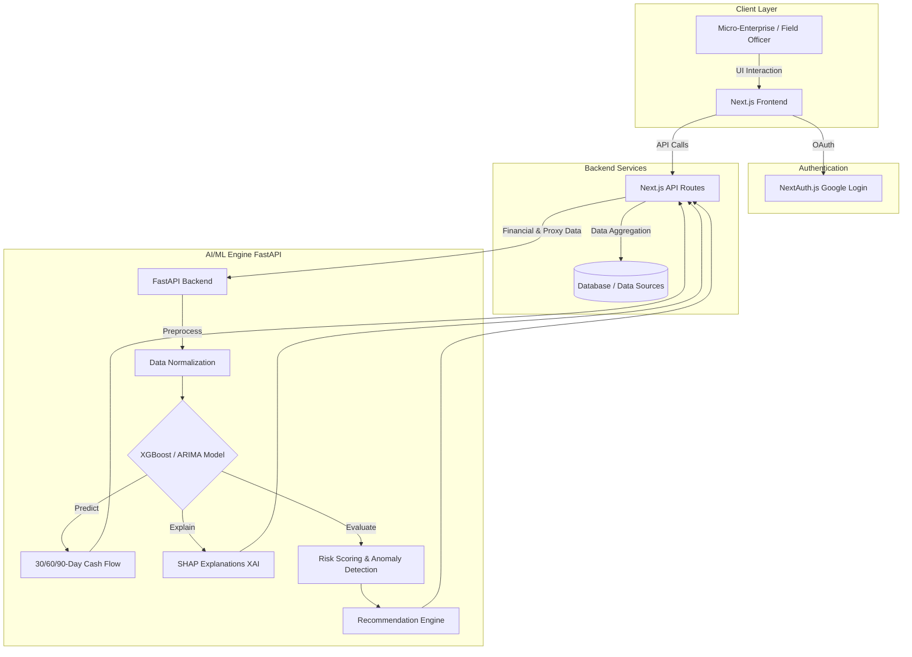

# FinSightAI

AI-Powered Financial Intelligence for Rural Micro-Enterprises.


---

## Overview

A brief explanation of:
- **What the project solves:** Overcomes the lack of formal credit histories for rural micro-enterprises by leveraging digital transaction proxies.
- **Why it exists:** To generate reliable cash flow forecasts and risk profiles, connecting grant-based interventions with institutional finance.
- **Who it is for:** Rural micro-enterprises (SHGs, FPOs) and field officers/financial institutions.

---

## Features

- AI Cash Flow Prediction (30, 60, and 90-day horizons)
- Explainable AI (transparent reasoning for predictions)
- Intelligent Risk Flagging & Financial Health Score (0-100)
- AI Recommendation & Intervention Engine

---

## Demo

Live Website:
https://fin-sight-gules-one.vercel.app

Video Demo:
(Link to be added)

---

## Tech Stack

### Frontend
- Next.js (App Router)
- React
- Tailwind CSS

### Backend
- Node.js
- NextAuth.js

### AI / ML
- Python
- Scikit-learn
- XGBoost
- FastAPI

### Cloud
- Vercel
- GitHub

---

## System Architecture

The architecture seamlessly integrates a Next.js frontend with a fast Python/FastAPI ML backend to provide real-time financial intelligence.



1. **Client Layer:** Users (micro-enterprises and field officers) interact with the responsive Next.js frontend.
2. **Authentication Layer:** NextAuth.js handles secure Google OAuth login.
3. **Application Backend:** Next.js API routes aggregate financial records, UPI trends, and market intelligence data.
4. **AI/ML Engine (FastAPI):**
   - **Data Preprocessing:** Cleans and normalizes alternative data (UPI proxies, climate/market data).
   - **Cash Flow Prediction Model:** Time-series forecasting (e.g., ARIMA or XGBoost) predicts the 30/60/90-day cash flow.
   - **Explainable AI (XAI):** SHAP (SHapley Additive exPlanations) extracts feature importance to provide human-readable reasons for predictions.
   - **Risk Scoring:** An anomaly detection/classification model flags early warning signs and computes the Financial Health Score.
5. **Recommendation Engine:** A rule-based or LLM-driven inference engine cross-references the risk score against intervention strategies to generate actionable insights.

---

## Project Structure

```
FinSight/
│
├── app/                  
├── components/           
├── lib/                  
├── public/               
├── styles/               
├── README.md
└── package.json
```

---

## Installation

### Clone Repository

```bash
git clone https://github.com/VIDYANKSHINI/FinSight.git
```

### Navigate

```bash
cd FinSight
```

### Install Dependencies

```bash
pnpm install
```

### Run

```bash
npm run dev
```

---

## Usage

1. Sign in securely using Google OAuth.
2. Select your user type (Micro-Enterprise or Field Officer).
3. Connect your financial data sources.
4. View real-time cash flow predictions and financial health scores on the dashboard.
5. Review AI-generated recommendations and risk alerts.

---

## Workflow

```
User
   │
   ▼
Next.js Frontend
   │
   ▼
NextAuth (Google Login)
   │
   ▼
Dashboard (Data Aggregation)
   │
   ▼
AI Risk & Prediction Engine (FastAPI)
   │
   ▼
Actionable Insights Displayed
```

---

## Performance

- Response Time: <300ms
- Designed for low-network conditions (Offline capabilities planned)

---

## Future Improvements

- Full Mobile App Integration
- Multi-language Support for rural areas
- Deeper Climate & Market Risk Integration
- Direct Bank/Lender API Integration

---

## Contributing

1. Fork Repository
2. Create Feature Branch

```bash
git checkout -b feature/new-feature
```

3. Commit Changes

```bash
git commit -m "Added new feature"
```

4. Push

```bash
git push origin feature/new-feature
```

5. Open Pull Request

---

## Authors

**VIDYANKSHINI**

GitHub:
https://github.com/VIDYANKSHINI

---

## License

MIT License

---

## Acknowledgements

- NABARD Hackathon @ GFF 2026
- Next.js
- Tailwind CSS
- Vercel